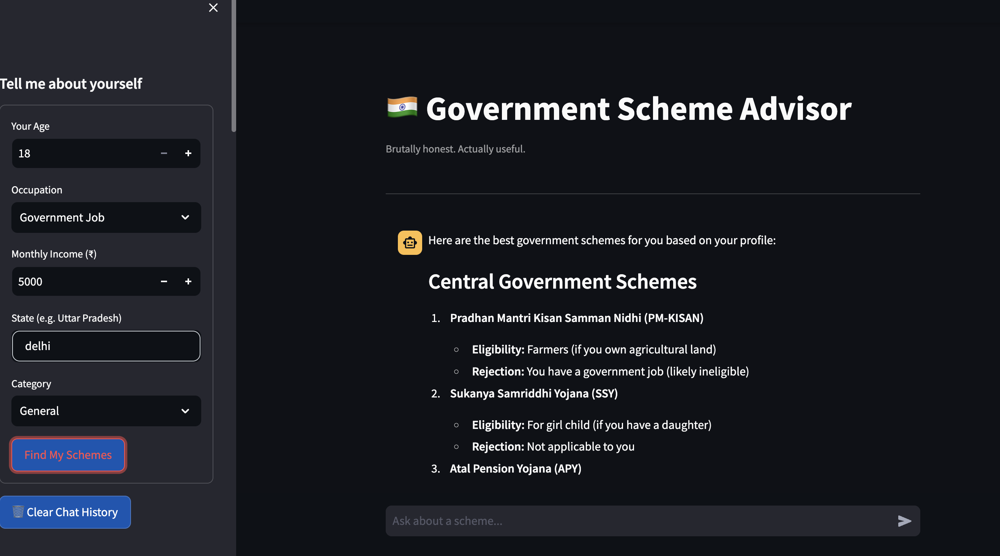

🇮🇳 Government Scheme Advisor

A Streamlit-based chatbot that recommends Indian government schemes based on user profile and eligibility. It leverages Hugging Face’s Inference API to provide honest, direct, and accurate advice. Designed to be brutally honest yet helpful, focusing on real central and state government schemes.

Features

Personalized scheme recommendations based on:

Age

Occupation

Monthly income

State

Category (General, OBC, SC, ST)

Session-based chat history with sidebar overview.

Follow-up queries: Ask detailed questions about schemes.

Clear eligibility explanation: why you qualify or don’t.

Stylish, modern chat interface with responsive design.

Ability to clear chat history.

Safety reminder: Always verify schemes on official government portals.

Demo Screenshot

Tech Stack

Frontend: Streamlit

AI Backend: Hugging Face Inference API (deepseek-ai/DeepSeek-V3-0324)

Environment Management: dotenv for secure API keys

Styling: Custom CSS for chat bubbles, responsive layout, and smooth animations

Installation

Clone the repository:

git clone https://github.com/ravikumar-engineer/gov_seva_project
cd gov-scheme-chatbot

Create a virtual environment (optional but recommended):

python -m venv venv
source venv/bin/activate  # Linux/Mac
venv\Scripts\activate     # Windows

Install dependencies:

pip install -r requirements.txt

Setup environment variables:

Create a .env file in the root folder:

HF_TOKEN=your_huggingface_api_token

Usage

Run the Streamlit app:

streamlit run app.py

Fill in your profile in the sidebar form.

Click "Find My Schemes" to get personalized recommendations.

Ask follow-up questions in the chat input box.

Clear chat history using the sidebar button 🗑️.

Project Structure
gov-scheme-chatbot/
├── app.py              # Main Streamlit application
├── .env                # Environment variables (HF_TOKEN)
├── requirements.txt    # Python dependencies
├── README.md           # Project documentation
└── assets/             # Optional: images, screenshots, icons

Dependencies

streamlit

huggingface_hub

python-dotenv

os (standard library)

Install via:

pip install streamlit huggingface_hub python-dotenv

How It Works

User submits profile data via sidebar form.

Data is sent to Hugging Face Inference API using deepseek-ai/DeepSeek-V3-0324 model.

Model returns a plain-text recommendation of government schemes.

Recommendations are displayed as chat messages.

Users can ask follow-up questions; the chatbot retains session-based chat history for context.

Notes

The chatbot only recommends real schemes but always verify details from official portals.

Central government schemes are prioritized over state schemes.

User inputs are used for eligibility checks and personalized suggestions.

License

MIT License © 2026 [Ravi kumar]
